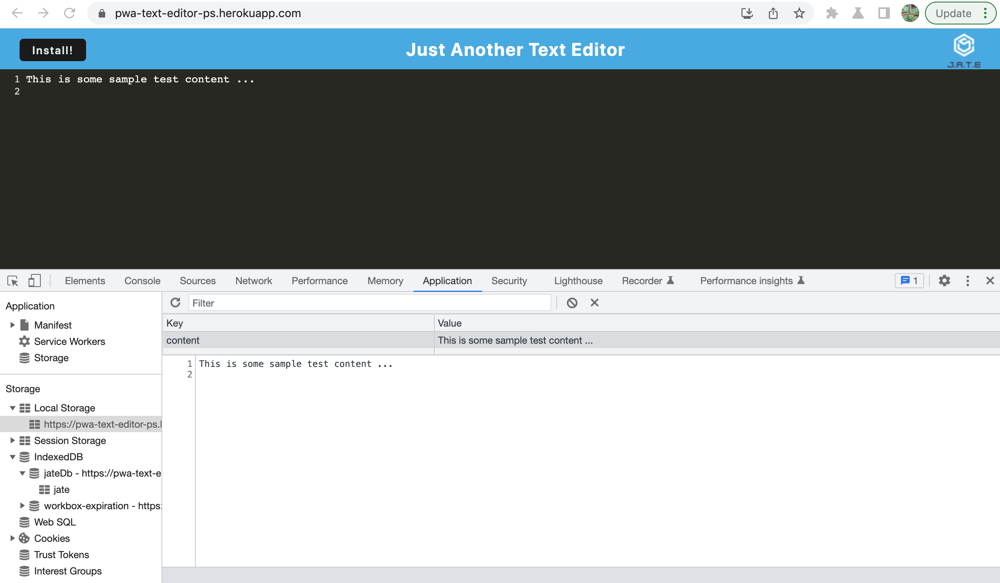

# PWA-Text-Editor-PS

## Table Of Contents
* [Description](#description)
* [Screenshots](#screenshots)
* [Installation](#installation)
* [Technologies](#technologies)
* [References](#references)
* [Author Links](#author-links)

## Description
This is a full stack Progressive Web App (PWA) - a text editor that can be installed on a device. The Express server receives a request from the client to display the home page. The client uses the local storage and indexedDB database to save and restore the contents of the editor. 


The deployed app is at: https://pwa-text-editor-ps.herokuapp.com/\
The github repo is: https://github.com/sbhikshe/PWA-Text-Editor-PS

## Screenshots

1. Home Screen - local storage


2. Text saved to indexedDb


## Installation
The application has been deployed to [Heroku](https://pwa-text-editor-ps.herokuapp.com/).  

The server can also be started from the command line with the command below, and used with a browser client (homepage at http://localhost:3000/).

```
$ node server.js
```

## Technologies
- Javascript
- express.js framework
- Webpack
- Workbox

## References
[Service worker - caching strategies](https://developer.chrome.com/docs/workbox/caching-strategies-overview/)\
[Service worker API - Cache](https://developer.mozilla.org/en-US/docs/Web/API/Cache)\
[Installable PWAs](https://developer.mozilla.org/en-US/docs/Web/Progressive_web_apps/Installable_PWAs)\
[Window - beforeInstallPrompt event](https://developer.mozilla.org/en-US/docs/Web/API/Window/beforeinstallprompt_event)

## Author Links
[GitHub](https://github.com/sbhikshe)\
[LinkedIn](https://www.linkedin.com/in/sripriya-bhikshesvaran-8520992/)
